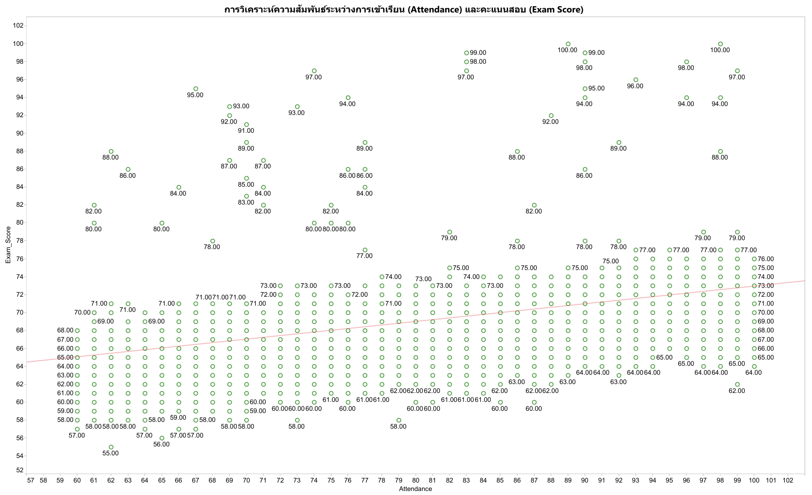

# 🎓 STUDENT PERFORMANCE FACTOR
โครงการนี้เป็นการศึกษา วิเคราะห์ข้อมูลเชิงลึกเกี่ยวกับ **ปัจจัยและพฤติกรรมที่ส่งผลต่อผลสัมฤทธิ์ทางการเรียนของนักเรียน**  
โดยมุ่งเน้นการทำความเข้าใจความสำคัญขององค์ประกอบต่าง ๆ เช่น:
- ร้อยละของการเข้าชั้นเรียน
- จำนวนชั่วโมงที่ศึกษาด้วยตนเอง
- การเข้าถึงทรัพยากรการเรียนรู้
- แรงจูงใจในการเรียน
- การมีส่วนร่วมในกิจกรรมการศึกษา

---

## 🧠 **Problem Statement/Background**
- เรารู้อะไรบ้าง:
  - ข้อมูลนักเรียนทั้งหมด 6,607 record
  - คะแนนสอบของนักเรียน โดยแบ่งเป็นเกรด (A, B, C, D)
  - ปัจจัยด้านพฤติกรรม เช่น ร้อยละของการเข้าชั้นเรียน, จำนวนชั่วโมงที่ศึกษาด้วยตนเอง
- ปัญหาที่ต้องการแก้ไข:  
  - สถานศึกษาอยากเพิ่มผลสัมฤทธิ์ทางการเรียน
  - การใช้ทรัพยากรหรือกิจกรรมสนับสนุนอย่างไร เพื่อเพิ่มผลสัมฤทธิ์ทางการเรียน
- ปัญหาในเชิงการบริหารจัดการ:
  - สถานศึกษามีนโยบายอย่างไรในการเพิ่มผลสัมฤทธิ์ทางการเรียนแก่นักเรียน
- ผู้มีส่วนได้ส่วนเสีย:  
  - นักเรียน, ผู้ปกครอง, ครู, ผู้บริหารโรงเรียน
---

## 🎯 **Objectives/SMART Objectives**
**Objectives**
1. เพื่อระบุและวิเคราะห์ปัจจัยที่มีผลต่อผลสัมฤทธิ์ทางการเรียนของนักเรียน
2. เพื่อวัดระดับความสัมพันธ์ระหว่างปัจจัยต่าง ๆ กับผลสัมฤทธิ์ทางการเรียน
3. เพื่อเสนอแนวทางหรือกลยุทธ์ในการปรับปรุงผลสัมฤทธิ์ทางการเรียนของนักเรียน

**SMART Objectives**

ยกระดับนักเรียนในกลุ่มคะแนนต่ำ (เกรด C, D) จำนวน 10% ให้อยู๋ในกลุ่มคะแนนสูง (A, B) ภายในสิ้นปีการศึกษา 2568
โดยใช้ทรัพยากรที่มีอยู่ เช่น การเพิ่มการเข้าชั้นเรียนและการเข้าถึงทรัพยากรต่าง ๆ ของโรงเรียน ซึ่งเป็นปัจจัยที่อยู่ในขอบเขตทรัพยากรที่มี

---

## ❓ **Questions & Hypotheses**
**Analytical Questions**
  1. ปัจจัยใดสัมพันธ์กับผลการเรียนมากที่สุด
  2. โรงเรียนต้องมีกลยุทธ์อะไร เพื่อให้ผลการเรียนของนักเรียนดีขึ้น

**Hypotheses**
- H₀: ระดับการเข้าชั้นเรียนของนักเรียนกลุ่มคะแนนสูง ไม่แตกต่าง จากนักเรียนกลุ่มคะแนนต่ำ
- H₁: ระดับการเข้าชั้นเรียนของนักเรียนกลุ่มคะแนนสูง แตกต่าง จากนักเรียนกลุ่มคะแนนต่ำ

---

## 📂 **Data Sources**
- ข้อมูลจาก www.kaggle.com

---

## 📚 Data Dictionary

| **Attribute**              | **Description**                                      | **Data Type**            | **Example**                     |
|---------------------------|------------------------------------------------------|---------------------------|---------------------------------|
| Hours_Studied            | Number of self-study hours per week                 | Ratio (Continuous)       | [0, ∞)                         |
| Attendance               | Percentage of attendance throughout the term        | Ratio (Continuous)       | [0, 100]                       |
| Parental_Involvement     | Level of parental support in academics              | Ordinal                  | Low, Medium, High              |
| Access_to_Resources      | Availability of academic resources like books or internet | Ordinal                  | Low, Medium, High              |
| Extracurricular_Activities| Participation in extracurricular activities         | Binary                   | Yes, No                        |
| Sleep_Hours              | Average hours of sleep per day                      | Ratio (Continuous)       | [0, ∞)                         |
| Previous_Scores          | Average of previous academic scores                 | Ratio (Continuous)       | [0, 100]                       |
| Motivation_Level         | Student’s motivation level                          | Ordinal                  | Low, Medium, High              |
| Internet_Access          | Whether the student has access to the internet      | Binary                   | Yes, No                        |
| Tutoring_Sessions        | Number of tutoring sessions per week                | Ratio (Continuous)       | [0, ∞)                         |
| Family_Income            | Family income                                       | Ratio (Continuous)       | [0, ∞)                         |
| Teacher_Quality          | Overall perceived teacher quality                   | Ordinal                  | Low, Medium, High              |
| SchoolType_ID            | Type of school                                      | Nominal                  | 1 = Public, 2 = Private        |
| Peer_Influence           | Influence of peers on academic performance          | Ordinal                  | Negative, Neutral, Positive    |
| Physical_Activity        | Hours of physical activity per week                 | Ratio (Continuous)       | [0, ∞)                         |
| Learning_Disabilities    | Presence of any learning disabilities               | Binary                   | Yes, No                        |
| Parental_Education_Level | Highest education level of parents                  | Ordinal                  | High School, College, Postgraduate |
| Distance_from_Home       | Distance between home and school                    | Ordinal                  | Near, Moderate, Far            |
| Gender                   | Student’s gender                                    | Nominal                  | Male, Female                   |
| Exam_Score               | Final exam score                                    | Ratio (Continuous)       | [0, 100]                       |
| Grade_Group              | Final Grade                                         | Ordinal                  | A, B, C, D                     |

---

## 🧹 Data Cleansing
**1. Missing Values**
   จากการตรวจสอบพบว่ามีอยู่ 3 Attribute ที่มีค่า Null ดังนี้
   - Teacher_Quality  จำนวน 78 Records
   - Parental_Education_Level จำนวน 90 Records
   - Distance_from_Home จำนวน 67 Records
  
  **วิเคราะห์ Missing Values**
  - Teacher_Quality อาจจะเป็น Missing Value แบบ MNAR เนื่องจากอาจจะมีความเป็นไปได้ว่า ครูที่คุณภาพไม่สูงมากเลี่ยงการให้ข้อมูล
  - Parental_Education_Level อาจจะเป็น Missing Value แบบ MNAR เนื่องจากอาจจะมีความเป็นไปได้ว่า ผู้ปกครองที่มีการศึกษาต่ำบางกลุ่มมีแนวโน้มไม่ตอบแบบสอบถาม
  - Distance_from_Home อาจจะเป็น Missing Value แบบ MCAR

  **แนวทางการจัดการ Missing Values**
  - Teacher_Quality แทนที่ค่า Null ด้วยกลุ่ม Unknown
  - Parental_Education_Level แทนที่ค่า Null ด้วยกลุ่ม Unknown
  - Distance_from_Home แทนที่ค่า Null ด้วยกลุ่ม Unknown

**2. ตรวจสอบ Data Type**
  - ปรับ Data Type ให้ถูกต้อง

**3. ลบ Space ส่วนเกิน**
  - ใช้ฟังก์ชั่น Trim ใน Power Qurey เพื่อลบ space ของข้อมูลที่มี Data Type เป็น text ทั้งหมด

---

## 📊 Hypothesis Testing Summary

| ลำดับ | ปัจจัย | H₀ (Null Hypothesis) | H₁ (Alternative Hypothesis) | P-value | สรุปผล |
|-------|---------|------------------------|------------------------------|---------|--------|
| 1 | Attendance | ร้อยละการเข้าเรียนของนักเรียน **ไม่สัมพันธ์** กับคะแนนสอบ | ร้อยละการเข้าเรียนของนักเรียน **สัมพันธ์** กับคะแนนสอบ |       |        |
| 2 | Hours_Studied | จำนวนชั่วโมงเรียนด้วยตนเอง **ไม่สัมพันธ์** กับคะแนนสอบ | จำนวนชั่วโมงเรียนเพิ่มเติม **สัมพันธ์** กับคะแนนสอบ |       |        |
| 3 | Sleep_Hours | จำนวนชั่วโมงนอน **ไม่สัมพันธ์** กับคะแนนสอบ | จำนวนชั่วโมงนอน **สัมพันธ์** กับคะแนนสอบ |       |        |
| 4 | Previous_Scores | คะแนนสอบก่อนหน้า **ไม่สัมพันธ์** กับคะแนนสอบปัจจุบัน | คะแนนสอบก่อนหน้า **สัมพันธ์** กับคะแนนสอบปัจจุบัน |       |        |
| 5 | Tutoring_Sessions | จำนวนครั้งติวพิเศษ **ไม่สัมพันธ์** กับคะแนนสอบ | จำนวนครั้งติวพิเศษ **สัมพันธ์** กับคะแนนสอบ |       |        |
| 6 | Internet_Access | การเข้าถึงอินเทอร์เน็ต **ไม่สัมพันธ์** กับคะแนนสอบ | การเข้าถึงอินเทอร์เน็ต **สัมพันธ์** กับคะแนนสอบ |       |        |
| 7 | Parental_Involvement | การมีส่วนร่วมของผู้ปกครอง **ไม่สัมพันธ์** กับคะแนนสอบ | การมีส่วนร่วมของผู้ปกครอง **สัมพันธ์** กับคะแนนสอบ |       |        |
| 8 | Parental_Education_Level | ระดับการศึกษาของผู้ปกครอง **ไม่สัมพันธ์** กับคะแนนสอบ | ระดับการศึกษาของผู้ปกครอง **สัมพันธ์** กับคะแนนสอบ |       |        |
| 9 | Family_Income | รายได้ครอบครัว **ไม่สัมพันธ์** กับคะแนนสอบ | รายได้ครอบครัว **สัมพันธ์** กับคะแนนสอบ |       |        |
|10 | Teacher_Quality | คุณภาพครู **ไม่สัมพันธ์** กับคะแนนสอบ | คุณภาพครู **สัมพันธ์** กับคะแนนสอบ |       |        |
|11 | Distance_from_Home | ระยะทางจากบ้านถึงโรงเรียน **ไม่สัมพันธ์** กับคะแนนสอบ | ระยะทางจากบ้านถึงโรงเรียน **สัมพันธ์** กับคะแนนสอบ |       |        |
|12 | Motivation_Level | ระดับแรงจูงใจ **ไม่สัมพันธ์** กับคะแนนสอบ | ระดับแรงจูงใจ **สัมพันธ์** กับคะแนนสอบ |       |        |

---

## 🔍 **EDA**
**Attendance vs Exam_Score**

