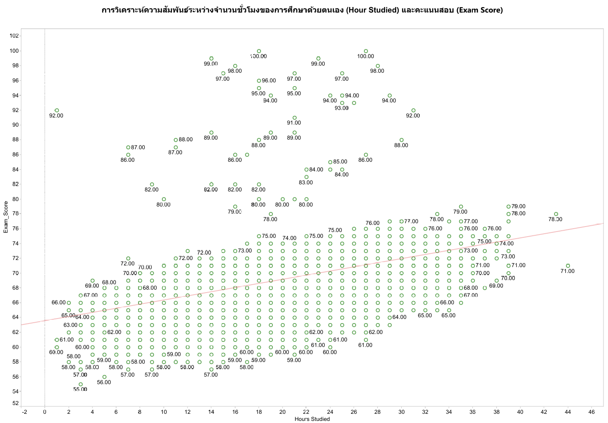
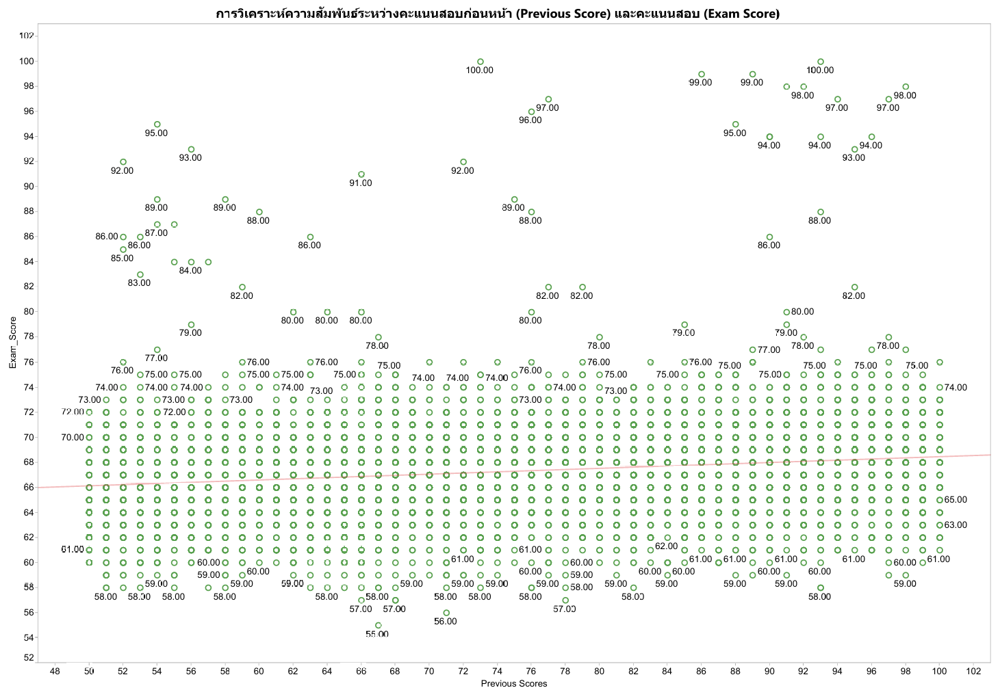
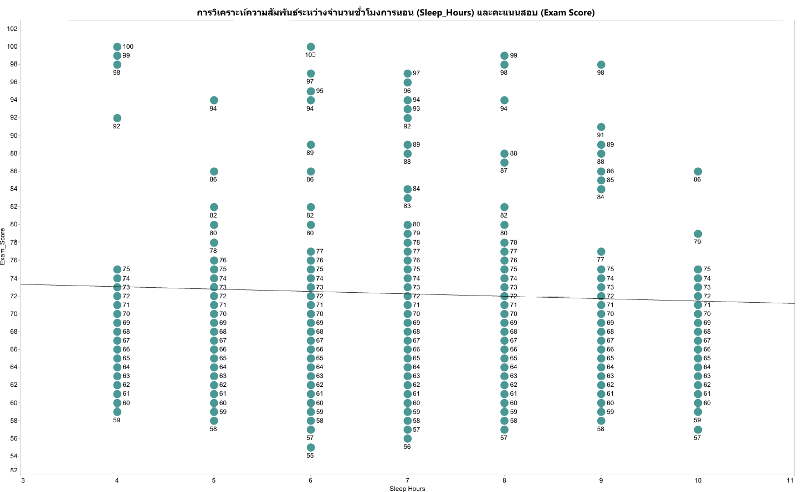
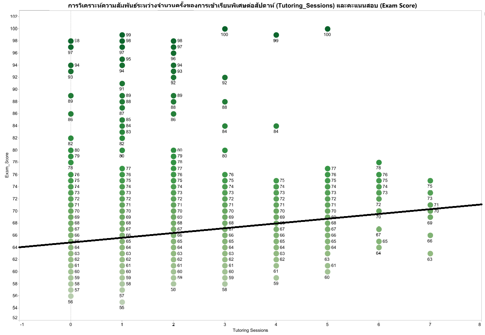
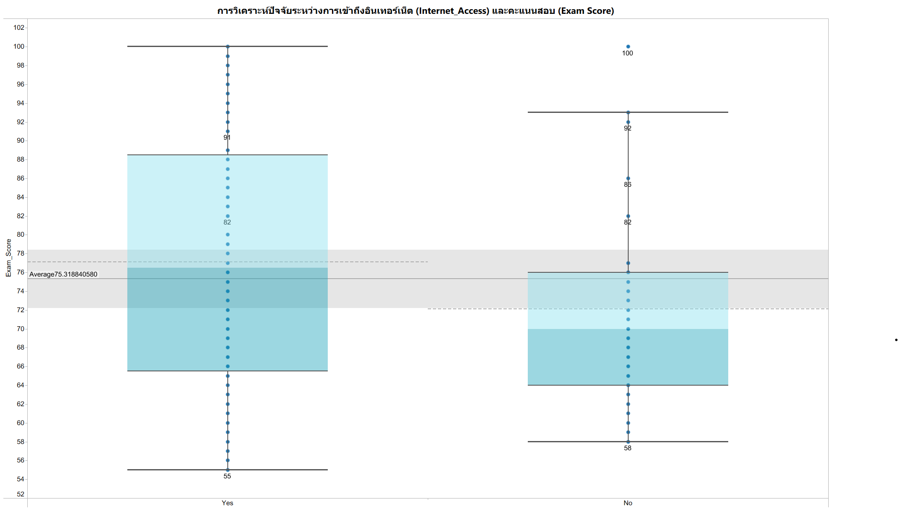
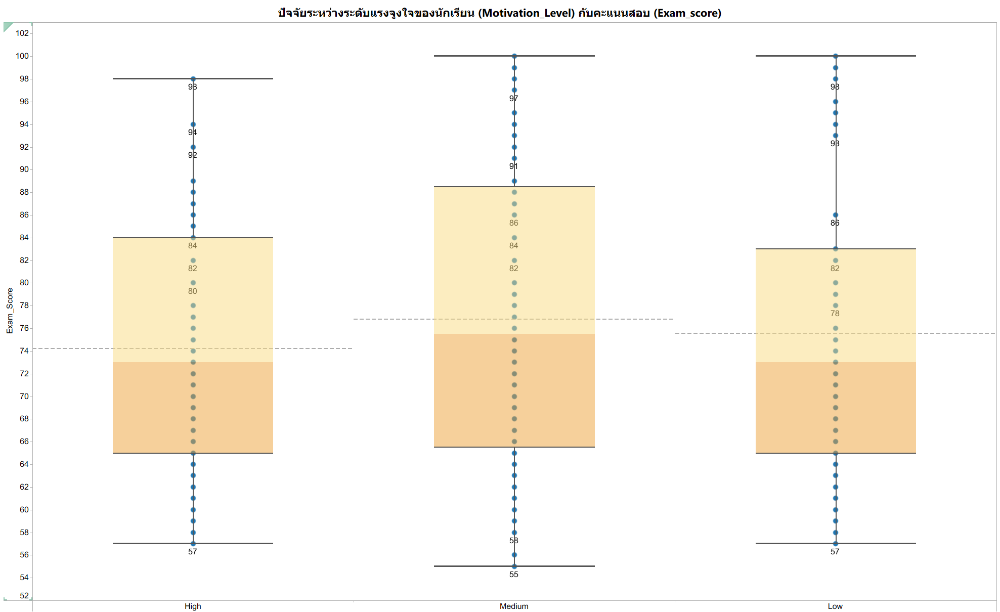
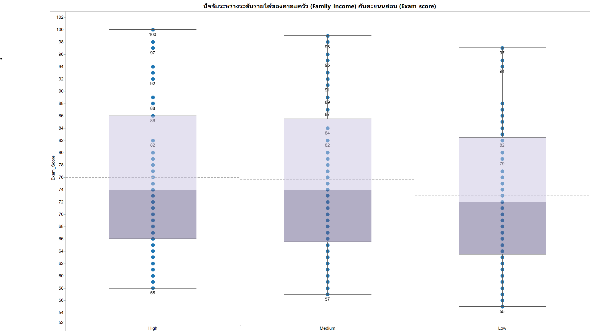
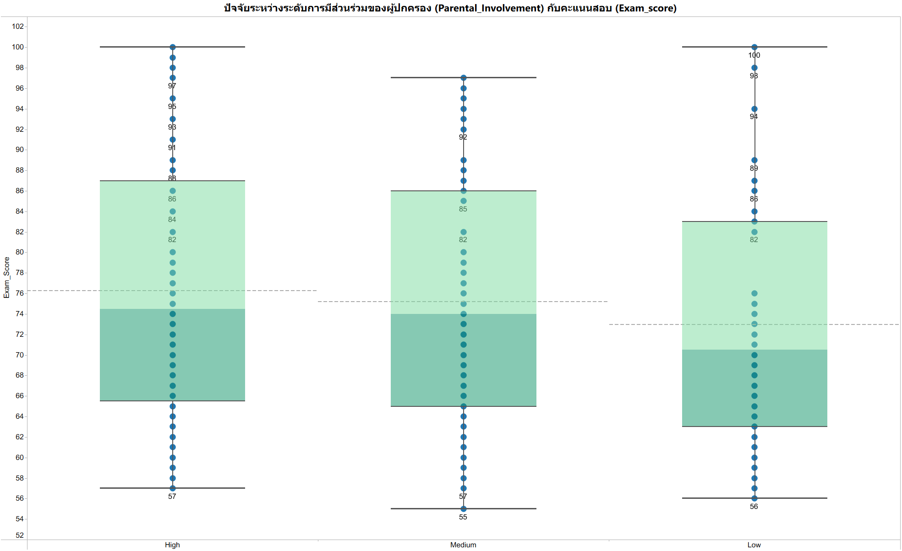

# 🎓 STUDENT PERFORMANCE FACTOR
โครงการนี้เป็นการศึกษา วิเคราะห์ข้อมูลเชิงลึกเกี่ยวกับ **ปัจจัยและพฤติกรรมที่ส่งผลต่อผลสัมฤทธิ์ทางการเรียนของนักเรียน**  
โดยมุ่งเน้นการทำความเข้าใจความสำคัญขององค์ประกอบต่าง ๆ เช่น:
- ร้อยละของการเข้าชั้นเรียน
- จำนวนชั่วโมงที่ศึกษาด้วยตนเอง
- การเข้าถึงทรัพยากรการเรียนรู้
- แรงจูงใจในการเรียน
- การมีส่วนร่วมในกิจกรรมการศึกษา

---

## 🧠 **Problem Statement/Background**
- Background:
  - ข้อมูลนักเรียนทั้งหมด 6,607 record จากโรงเรียนรัฐบาล และโรงเรียนเอกชน ในประเทศไทย
  - คะแนนสอบของนักเรียน
  - ปัจจัยด้านพฤติกรรม เช่น ร้อยละของการเข้าชั้นเรียน, จำนวนชั่วโมงที่ศึกษาด้วยตนเอง, ชั่วโมงการนอน เป็นต้น
- ปัญหาที่ต้องการแก้ไข:  
  - สถานศึกษาอยากเพิ่มผลสัมฤทธิ์ทางการเรียน
  - การใช้ทรัพยากรหรือกิจกรรมสนับสนุนอย่างไร เพื่อเพิ่มผลสัมฤทธิ์ทางการเรียน
- ปัญหาในเชิงการบริหารจัดการ:
  - สถานศึกษามีนโยบายอย่างไรในการเพิ่มผลสัมฤทธิ์ทางการเรียนแก่นักเรียน
- ผู้มีส่วนได้ส่วนเสีย:  
  - นักเรียน, ผู้ปกครอง, ครู, ผู้บริหารสถานศึกษา
---

## 🎯 **Objectives/SMART Objectives**
**Objectives**
1. เพื่อระบุและวิเคราะห์ปัจจัยที่มีผลต่อผลสัมฤทธิ์ทางการเรียนของนักเรียน
2. เพื่อวัดระดับความสัมพันธ์ระหว่างปัจจัยต่าง ๆ กับผลสัมฤทธิ์ทางการเรียน
3. เพื่อเสนอแนวทางหรือกลยุทธ์ในการปรับปรุงผลสัมฤทธิ์ทางการเรียนของนักเรียน

**SMART Objectives**

ยกระดับนักเรียนในกลุ่มคะแนนต่ำ (คะแนนสอบ < 70) จำนวน 10% ให้อยู่ในกลุ่มคะแนนสูง (คะแนนสอบ ≥ 70) ภายในสิ้นปีการศึกษา 2568
โดยใช้ทรัพยากรที่มีอยู่ เช่น การเพิ่มการเข้าชั้นเรียนและการเข้าถึงทรัพยากรต่าง ๆ ของสถานศึกษา ซึ่งเป็นปัจจัยที่อยู่ในขอบเขตทรัพยากรที่มี

---

## ❓ **Analytical Questions**
  1. ปัจจัยใดสัมพันธ์กับผลการเรียนมากที่สุด
  2. สถานศึกษาต้องมีกลยุทธ์อะไร เพื่อให้ผลการเรียนของนักเรียนดีขึ้น

---

## 📂 **Data Sources**
- ข้อมูลจาก [www.kaggle.com](https://www.kaggle.com/datasets/lainguyn123/student-performance-factors)

---

## 📚 **Data Dictionary**

| **Attribute**              | **Description**                                      | **Data Type**            | **Example**                     |
|---------------------------|------------------------------------------------------|---------------------------|---------------------------------|
| Hours_Studied            | Number of self-study hours per week                 | Ratio (Continuous)       | [0, ∞)                         |
| Attendance               | Percentage of attendance throughout the term        | Ratio (Continuous)       | [0, 100]                       |
| Parental_Involvement     | Level of parental support in academics              | Ordinal                  | Low, Medium, High              |
| Access_to_Resources      | Availability of academic resources like books or internet | Ordinal                  | Low, Medium, High              |
| Extracurricular_Activities| Participation in extracurricular activities         | Binary                   | Yes, No                        |
| Sleep_Hours              | Average hours of sleep per day                      | Ratio (Continuous)       | [0, ∞)                         |
| Previous_Scores          | Average of previous academic scores                 | Ratio (Continuous)       | [0, 100]                       |
| Motivation_Level         | Student’s motivation level                          | Ordinal                  | Low, Medium, High              |
| Internet_Access          | Whether the student has access to the internet      | Binary                   | Yes, No                        |
| Tutoring_Sessions        | Number of tutoring sessions per week                | Ratio (Continuous)       | [0, ∞)                         |
| Family_Income            | Family income                                       | Ratio (Continuous)       | [0, ∞)                         |
| Teacher_Quality          | Overall perceived teacher quality                   | Ordinal                  | Low, Medium, High              |
| SchoolType_ID            | Type of school                                      | Nominal                  | 1 = Public, 2 = Private        |
| Peer_Influence           | Influence of peers on academic performance          | Ordinal                  | Negative, Neutral, Positive    |
| Physical_Activity        | Hours of physical activity per week                 | Ratio (Continuous)       | [0, ∞)                         |
| Learning_Disabilities    | Presence of any learning disabilities               | Binary                   | Yes, No                        |
| Parental_Education_Level | Highest education level of parents                  | Ordinal                  | High School, College, Postgraduate |
| Distance_from_Home       | Distance between home and school                    | Ordinal                  | Near, Moderate, Far            |
| Gender                   | Student’s gender                                    | Nominal                  | Male, Female                   |
| Exam_Score               | Final exam score                                    | Ratio (Continuous)       | [0, 100]                       |
| Grade_Group              | Final Grade                                         | Ordinal                  | A, B, C, D                     |

---

## 🧹 **Data Cleansing**
**1. Missing Values**
   จากการตรวจสอบพบว่ามีอยู่ 3 Attribute ที่มีค่า Null ดังนี้
   - Teacher_Quality  จำนวน 78 Records
   - Parental_Education_Level จำนวน 90 Records
   - Distance_from_Home จำนวน 67 Records
  
  **วิเคราะห์ Missing Values**
  - Teacher_Quality อาจจะเป็น Missing Value แบบ MNAR เนื่องจากอาจจะมีความเป็นไปได้ว่า ครูที่คุณภาพไม่สูงมากเลี่ยงการให้ข้อมูล
  - Parental_Education_Level อาจจะเป็น Missing Value แบบ MNAR เนื่องจากอาจจะมีความเป็นไปได้ว่า ผู้ปกครองที่มีการศึกษาต่ำบางกลุ่มมีแนวโน้มไม่ตอบแบบสอบถาม
  - Distance_from_Home อาจจะเป็น Missing Value แบบ MCAR

  **แนวทางการจัดการ Missing Values**
  - Teacher_Quality แทนที่ค่า Null ด้วยกลุ่ม Unknown
  - Parental_Education_Level แทนที่ค่า Null ด้วยกลุ่ม Unknown
  - Distance_from_Home แทนที่ค่า Null ด้วยกลุ่ม Unknown

**2. ตรวจสอบ Data Type**
  - ปรับ Data Type ให้ถูกต้อง

**3. ลบ Space ส่วนเกิน**
  - ใช้ฟังก์ชั่น Trim ใน Power Qurey เพื่อลบ space ของข้อมูลที่มี Data Type เป็น text ทั้งหมด

---

# 🔍 **Exploratory Data Analysis (EDA)**

## 🔑 ปัจจัยหลัก

### 🛠️ วิธีการวิเคราะห์
- ใช้การทดสอบแบบ two-tailed ในการตั้งกรอบสมมติฐาน **H₀/H₁**:
  - **H₀:** ไม่มีความสัมพันธ์ระหว่างปัจจัยกับคะแนนสอบ (ρ = 0)
  - **H₁:** มีความสัมพันธ์ระหว่างปัจจัยกับคะแนนสอบ (ρ ≠ 0)
- ใช้ **Pearson correlation** เพื่อวัดความสัมพันธ์เชิงเส้น และ p-value
- ใช้ **Spearman correlation** เพื่อวัดความสัมพันธ์เชิงอันดับ
- ระดับนัยสำคัญ: **α = 0.05**
- เครื่องมือที่ใช้: ใช้ Python ในการคำนวน correlation, ใช้ tableau ในการทำ Visualization

### 📑 Hypothesis Testing

| ลำดับ | ปัจจัย | H₀ (Null Hypothesis) | H₁ (Alternative Hypothesis) |
|-------|---------|------------------------|------------------------------|
| 1 | Attendance | ร้อยละการเข้าเรียนของนักเรียน **ไม่สัมพันธ์** กับคะแนนสอบ | ร้อยละการเข้าเรียนของนักเรียน **สัมพันธ์** กับคะแนนสอบ |
| 2 | Hours_Studied | จำนวนชั่วโมงเรียนด้วยตนเอง **ไม่สัมพันธ์** กับคะแนนสอบ | จำนวนชั่วโมงเรียนด้วยตนเอง **สัมพันธ์** กับคะแนนสอบ |
| 3 | Previous_Score | คะแนนสอบก่อนหน้า **ไม่สัมพันธ์** กับคะแนนสอบ | คะแนนสอบก่อนหน้า **สัมพันธ์** กับคะแนนสอบ |
| 4 | Sleep_Hours | จำนวนชั่วโมงการนอน **ไม่สัมพันธ์** กับคะแนนสอบ | จำนวนชั่วโมงการนอน **สัมพันธ์** กับคะแนนสอบ |
| 5 | Tutoring_Sessions | จำนวนครั้งของการเข้าเรียนพิเศษต่อสัปดาห์  **ไม่สัมพันธ์** กับคะแนนสอบ | จำนวนครั้งของการเข้าเรียนพิเศษต่อสัปดาห์ **สัมพันธ์** กับคะแนนสอบ |

---

### **📅 1. ค่าความสัมพันธ์ระหว่างร้อยละของการเข้าชั้นเรียน (Attendance) กับคะแนนสอบ (Exam_score)**

#### การทดสอบสมมติฐาน: ความสัมพันธ์ระหว่างการเข้าเรียนกับคะแนนสอบ

#### Hypothesis
- **H₀:** ร้อยละการเข้าเรียนของนักเรียน **ไม่สัมพันธ์** กับคะแนนสอบ
- **H₁:** ร้อยละการเข้าเรียนของนักเรียน **สัมพันธ์** กับคะแนนสอบ

#### ผลการทดสอบ
| วิธีการ       | ค่าสัมประสิทธิ์ | p-value       |
|---------------|-------------------|--------------|
| Pearson       | 0.5812           | 0.000e+00 |
| Spearman      | 0.6724           | 0.000e+00 |

#### การตัดสินใจ
- เนื่องจาก **p-value < 0.05** สำหรับทั้ง Pearson และ Spearman → **Reject H₀**
- ยอมรับ **H₁**: ร้อยละการเข้าเรียนของนักเรียน **สัมพันธ์เชิงบวก** กับคะแนนสอบอย่างมีนัยสำคัญทางสถิติ

#### การตีความ
- การเข้าเรียนมีผลต่อคะแนนสอบอย่างชัดเจน: นักศึกษาที่เข้าเรียนมากกว่ามักได้คะแนนสูงกว่า
- ความสัมพันธ์อยู่ในระดับ **ปานกลางถึงสูง** (Pearson ≈ 0.58, Spearman ≈ 0.67)
- ทั้ง Pearson และ Spearman ยืนยันว่า Attendance เป็นตัวแปรสำคัญที่สัมพันธ์กับผลการสอบ

---

### **📚 2. ค่าความสัมพันธ์ระหว่างจำนวนชั่วโมงของการศึกษาด้วยตนเอง (Hour_Studied) กับคะแนนสอบ (Exam_score)**

#### การทดสอบสมมติฐาน: ความสัมพันธ์ระหว่างการเข้าเรียนกับคะแนนสอบ

#### Hypothesis
- **H₀:** จำนวนชั่วโมงเรียนด้วยตนเอง **ไม่สัมพันธ์** กับคะแนนสอบ
- **H₁:** จำนวนชั่วโมงเรียนด้วยตนเอง **สัมพันธ์** กับคะแนนสอบ

#### ผลการทดสอบ
| วิธีการ       | ค่าสัมประสิทธิ์ | p-value       |
|---------------|-------------------|--------------|
| Pearson       | 0.4456           | 8.823e-320 |
| Spearman      | 0.4810          | 0.000e+00 |

#### การตัดสินใจ
- เนื่องจาก **p-value < 0.05** สำหรับทั้ง Pearson และ Spearman → **Reject H₀**
- ยอมรับ **H₁**: จำนวนชั่วโมงเรียนด้วยตนเอง **สัมพันธ์เชิงบวก** กับคะแนนสอบอย่างมีนัยสำคัญทางสถิติ

#### การตีความ
- จำนวนชั่วโมงเรียนด้วยตนเองมีผลต่อคะแนนสอบอย่างชัดเจน: นักศึกษามีจำนวนชั่วโมงเรียนด้วยตนเองมากกว่ามักได้คะแนนสูงกว่า
- ความสัมพันธ์อยู่ในระดับ **ปานกลางถึงสูง** (Pearson ≈ 0.45, Spearman ≈ 0.48)
- ทั้ง Pearson และ Spearman ยืนยันว่า Hour_Studied เป็นตัวแปรสำคัญที่สัมพันธ์กับผลการสอบ

---

### **📝 3. ค่าความสัมพันธ์ระหว่างคะแนนสอบก่อนหน้า (Previous_score) กับคะแนนสอบ (Exam_score)**

#### การทดสอบสมมติฐาน: ความสัมพันธ์ระหว่างคะแนนสอบก่อนหน้ากับคะแนนสอบ

#### Hypothesis
- **H₀:** คะแนนสอบก่อนหน้า **ไม่สัมพันธ์** กับคะแนนสอบ
- **H₁:** คะแนนสอบก่อนหน้า **สัมพันธ์** กับคะแนนสอบ

#### ผลการทดสอบ
| วิธีการ       | ค่าสัมประสิทธิ์ | p-value       |
|---------------|-------------------|--------------|
| Pearson       | 0.1751           | 1.230e-46 |
| Spearman      | 0.1919          | 7.404e-56 |

#### การตัดสินใจ
- เนื่องจาก **p-value < 0.05** สำหรับทั้ง Pearson และ Spearman → **Reject H₀**
- ยอมรับ **H₁**: คะแนนสอบก่อนหน้า **สัมพันธ์เชิงบวก** กับคะแนนสอบอย่างมีนัยสำคัญทางสถิติ

#### การตีความ
- ความสัมพันธ์อยู่ในระดับ **ค่อนข้างน้อย** (Pearson ≈ 0.18, Spearman ≈ 0.19)
- คะแนนสอบก่อนหน้ามีความสัมพันธ์กับต่อคะแนนสอบเพียงเล็กน้อยเท่านั้น แม้มีนัยสำคัญทางสถิติ
- ยังไม่ใช่ตัวแปรสำคัญต่อคะแนนสอบ ยังมีตัวแปรอื่นที่สัมพันธ์กว่ามาก (Attendance, Hours_Studied)

---

### **😴 4. ค่าความสัมพันธ์ระหว่างจำนวนชั่วโมงการนอน (Sleep_Hours) กับคะแนนสอบ (Exam_score)**

#### การทดสอบสมมติฐาน: ความสัมพันธ์ระหว่างจำนวนชั่วโมงการนอนกับคะแนนสอบ

#### Hypothesis
- **H₀:** จำนวนชั่วโมงการนอน **ไม่สัมพันธ์** กับคะแนนสอบ
- **H₁:** จำนวนชั่วโมงการนอน **สัมพันธ์** กับคะแนนสอบ

#### ผลการทดสอบ
| วิธีการ       | ค่าสัมประสิทธิ์ | p-value       |
|---------------|-------------------|--------------|
| Pearson       | −0.0170          | 0.1671 |
| Spearman      | −0.0076          | 0.5353 |

#### การตัดสินใจ
- เนื่องจาก **p-value ≥ 0.05** สำหรับทั้ง Pearson และ Spearman → **Fail to reject H₀**
- **ไม่มีหลักฐานเพียงพอ** ที่จะสรุปว่า ชั่วโมงการนอนสัมพันธ์กับคะแนนสอบ

#### การตีความ
- **ไม่มีความสัมพันธ์เชิงเส้น/เชิงอันดับที่มีนัยสำคัญ** ระหว่างชั่วโมงการนอนกับคะแนนสอบในข้อมูลนี้

---

### **👩‍🏫 5. ค่าความสัมพันธ์ระหว่างจำนวนครั้งของการเข้าเรียนพิเศษต่อสัปดาห์ (Tutoring_Sessions) กับคะแนนสอบ (Exam_score)**

#### การทดสอบสมมติฐาน: ความสัมพันธ์ระหว่างครั้งของการเข้าเรียนพิเศษต่อสัปดาห์กับคะแนนสอบ

#### Hypothesis
- **H₀:** จำนวนครั้งของการเข้าเรียนพิเศษต่อสัปดาห์  **ไม่สัมพันธ์** กับคะแนนสอบ
- **H₁:** จำนวนครั้งของการเข้าเรียนพิเศษต่อสัปดาห์ **สัมพันธ์** กับคะแนนสอบ

#### ผลการทดสอบ
| วิธีการ       | ค่าสัมประสิทธิ์ | p-value       |
|---------------|-------------------|--------------|
| Pearson       | 0.1565          | 1.688e-37 |
| Spearman      | 0.1639          | 5.013e-41 |

#### การตัดสินใจ
- เนื่องจาก **p-value < 0.05** สำหรับทั้ง Pearson และ Spearman → **Reject H₀**
- ยอมรับ **H₁**: จำนวนครั้งของการเข้าเรียนพิเศษต่อสัปดาห์ **สัมพันธ์เชิงบวก** กับคะแนนสอบอย่างมีนัยสำคัญทางสถิติ

#### การตีความ
- ความสัมพันธ์อยู่ในระดับ **ค่อนข้างน้อย** (Pearson ≈ 0.16, Spearman ≈ 0.16) แต่ชัดเจนด้วยขนาดตัวอย่างที่มาก

---
## 🧩 ปัจจัยรอง

### 🛠️ วิธีการวิเคราะห์
- อธิบายด้วยสถิติเบื้องต้น (Mean, Median, SD) และกราฟ
- เครื่องมือที่ใช้: ใช้ Python ในการคำนวน Mean, Median, SD และ ใช้ tableau ในการทำ Visualization

#### **🌐 1. ปัจจัยระหว่างการเข้าถึงอินเทอร์เน็ต (Internet_Access) กับคะแนนสอบ (Exam_score)**

#### สถิติเบื้องต้น
| กลุ่ม           | Mean | Median | SD    | จำนวน    |
|-----------------|------|--------|-------|------|
| Yes (มีอินเทอร์เน็ต)   | 67.29 | 67     | 3.87 | 6108 |
| No (ไม่มีอินเทอร์เน็ต) | 66.53 | 66     | 4.10 | 499 |

**ผลต่างค่าเฉลี่ย:** ≈ 0.76 คะแนน  
**ผลต่างมัธยฐาน:** ≈ 1 คะแนน

#### การตีความ
- Mean และ Median ของกลุ่ม Yes สูงกว่า No → นักเรียนที่มีอินเทอร์เน็ตมีแนวโน้มทำคะแนนสอบสูงกว่า
- ผลต่าง ~1 คะแนน แม้ไม่มาก แต่สอดคล้องกันทั้งค่าเฉลี่ยและมัธยฐาน
- การกระจาย (IQR) ใน Box Plot ของกลุ่มมี Internet กว้างกว่าเล็กน้อย → คะแนนหลากหลายมากกว่า

#### **💪 2. ปัจจัยระหว่างระดับแรงจูงใจของนักเรียน (Motivation_Level) กับคะแนนสอบ (Exam_score)**

#### สถิติเบื้องต้น
| กลุ่ม           | Mean | Median | SD    | จำนวน    |
|-----------------|------|--------|-------|------|
| High | 67.70 | 67     | 3.88 | 1319 |
| Medium | 67.33 | 67     | 3.83 | 3351 |
| Low | 66.75 | 67     | 3.95 | 1937 |

#### การตีความ
- ค่าเฉลี่ย (Mean) ของคะแนนสอบมีแนวโน้มเพิ่มขึ้นเล็กน้อยเมื่อระดับแรงจูงใจสูงขึ้น (จาก Low → Medium → High)
- มัธยฐาน (Median) ของทุกกลุ่มเท่ากันที่ 67 คะแนน แสดงว่ากึ่งกลางของข้อมูลไม่ต่างกันมาก
- ส่วนเบี่ยงเบนมาตรฐาน (SD) ใกล้เคียงกันทุกกลุ่ม แสดงว่าความกระจายของคะแนนสอบในแต่ละกลุ่มคล้ายกัน
- จำนวนข้อมูล (n) กลุ่ม Medium มีมากที่สุด ซึ่งอาจทำให้ค่าเฉลี่ยของกลุ่มนี้มีความเสถียรกว่ากลุ่มอื่น
- จากข้อมูลทั้งหมดข้างต้น สรุปได้ว่าค่าเฉลี่ยคะแนนสอบของนักเรียนที่มีแรงจูงใจสูง จะสูงกว่ากลุ่มที่มีแรงจูงใจต่ำเล็กน้อย แต่ความแตกต่างไม่มากนัก

---

#### **💰 3. ปัจจัยระหว่างระดับรายได้ของครอบครัว (Family_Income) กับคะแนนสอบ (Exam_score)**

#### สถิติเบื้องต้น
| กลุ่ม           | Mean | Median | SD    | จำนวน    |
|-----------------|------|--------|-------|------|
| High | 67.84 | 68     | 4.15 | 1269 |
| Medium | 67.33 | 67     | 3.81 | 2666 |
| Low | 66.85 | 67     | 3.80 | 2672 |

#### การตีความ
- ค่าเฉลี่ย (Mean) มีแนวโน้ม สูงขึ้นเล็กน้อย เมื่อระดับรายได้สูงขึ้น (Low → Medium → High) แต่ส่วนต่าง ไม่ได้มากนัก
- มัธยฐาน (Median) ของกลุ่ม Low/Medium อยู่ที่ 67, ส่วน High อยู่ที่ 68 สะท้อนว่ากึ่งกลางของคะแนนในกลุ่มรายได้สูง สูงกว่าเล็กน้อย
- ส่วนเบี่ยงเบนมาตรฐาน (SD) ใกล้เคียงกัน (ประมาณ 3.8–4.2) แปลว่า การกระจายคะแนน ในแต่ละกลุ่มรายได้ คล้ายกัน ไม่มีความแตกต่างด้านความกว้างของการกระจายมากนัก
- จากข้อมูลทั้งหมดข้างต้น สรุปได้ว่าค่าเฉลี่ยคะแนนสอบมีแนวโน้มสูงขึ้นเล็กน้อยตามระดับรายได้ครอบครัว แต่ความแตกต่างไม่มากนัก

---

#### **⚽ 4. ปัจจัยระหว่างการเข้าร่วมกิจกรรมนอกหลักสูตร (Extracurricular_Activities) กับคะแนนสอบ (Exam_score)**

#### สถิติเบื้องต้น
| กลุ่ม           | Mean | Median | SD    | จำนวน    |
|-----------------|------|--------|-------|------|
| Yes | 67.44 | 67     | 3.94 | 3,938 |
| No | 66.93 | 67     | 3.79 | 2,669 |

#### การตีความ
- ค่าเฉลี่ย (Mean): ผู้ที่ เข้าร่วมกิจกรรมนอกหลักสูตรมีคะแนนเฉลี่ยสูงกว่าผู้ที่ไม่เข้าร่วมเล็กน้อย โดยต่างกันประมาณ 0.51 คะแนน (67.44 vs 66.93)
- มัธยฐาน (Median): ทั้งสองกลุ่มมีมัธยฐานเท่ากันที่ 67 คะแนน แสดงว่ากึ่งกลางของการกระจายคะแนนใกล้เคียงกันมาก
- ส่วนเบี่ยงเบนมาตรฐาน (SD): ค่ากระจายคะแนน คล้ายกัน (ประมาณ 3.8–3.9) บ่งชี้ว่า ความหลากหลายของคะแนน ในสองกลุ่ม ไม่ต่างกันมาก
- จำนวนข้อมูล: กลุ่ม Yes มีจำนวนมากกว่า (3,938 vs 2,669) ทำให้ค่าเฉลี่ยของกลุ่มนี้ มีความเสถียรกว่าเล็กน้อยในการอธิบายภาพรวม
- นักศึกษาที่เข้าร่วมกิจกรรมนอกหลักสูตรมีคะแนนเฉลี่ยสูงกว่าผู้ที่ไม่เข้าร่วมเล็กน้อย แต่กึ่งกลางและการกระจายคะแนนของทั้งสองกลุ่มใกล้เคียงกันมาก

---

#### **🤝 5. ปัจจัยระหว่างระดับการมีส่วนร่วมของผู้ปกครอง (Parental_Involvement) กับคะแนนสอบ (Exam_score)**

#### สถิติเบื้องต้น
| กลุ่ม           | Mean | Median | SD    | จำนวน    |
|-----------------|------|--------|-------|------|
| High | 68.09 | 68     | 3.95 | 1,908 |
| Medium | 67.10 | 67     | 3.73 | 3,362 |
| Low | 66.36 | 66     | 3.96 | 1,337 |

#### การตีความ
- ค่าเฉลี่ย (Mean) เพิ่มขึ้นตามระดับการมีส่วนร่วมของผู้ปกครอง: Low → Medium → High (ประมาณ 66.4 → 67.1 → 68.1 คะแนน) สะท้อนว่า ผู้ปกครองมีส่วนร่วมมากขึ้น → คะแนนเฉลี่ยสูงขึ้นเล็กน้อย
- มัธยฐาน (Median) เพิ่มจาก 66 (Low) เป็น 67 (Medium) และ 68 (High) แสดงว่ากึ่งกลางการกระจายคะแนน ขยับสูงขึ้นตามระดับการมีส่วนร่วม
- ส่วนเบี่ยงเบนมาตรฐาน (SD) ใกล้เคียงกัน (≈3.7–4.0) หมายถึง ความกระจายคะแนน ในแต่ละกลุ่ม คล้ายกัน ไม่มีความแตกต่างด้านความแปรปรวนมากนัก
- เมื่อการมีส่วนร่วมของผู้ปกครองสูงขึ้น คะแนนสอบมีแนวโน้มสูงขึ้นเล็กน้อยทั้งในค่าเฉลี่ยและกึ่งกลางของข้อมูล โดยความกระจายคะแนนในแต่ละระดับใกล้เคียงกัน

---

## **✅ Findings and Insights**

### **🔑 ปัจจัยหลัก**

##### 📈 Hypothesis Summary

| ลำดับ | ปัจจัยหลัก | Pearson r (95% CI) | Spearman ρ | p-value | Decision |
|:--:|---|---:|---:|---:|---|
| 1 | Attendance | **0.5812** (0.5650–0.5970) | **0.6724** | 0.000e+00 | **Reject H₀** |
| 2 | Hours_Studied | **0.4456** (0.4260–0.4647) | **0.4810** | 8.823e-320 | **Reject H₀** |
| 3 | Previous_Scores | **0.1751** (0.1516–0.1984) | **0.1919** | 1.230e-46 | **Reject H₀** |
| 4 | Sleep_Hours | **−0.0170** (−0.0411–0.0071) | **−0.0076** | 0.1671 | **Fail to reject H₀** |
| 5 | Tutoring_Sessions | **0.1565** (0.1329–0.1799) | **0.1639** | 1.688e-37 | **Reject H₀** |

จากผลการศึกษาและวิเคราะห์ข้อมูลพบว่า **การเข้าชั้นเรียน (Attendance)** เป็นปัจจัยที่มีความสัมพันธ์กับคะแนนสอบ**มากที่สุด**โดยมีค่าสหสัมพันธ์สูงทั้งแบบ Pearson และ Spearman ซึ่งสะท้อนว่าการเข้าเรียนสม่ำเสมอมีผลต่อผลสัมฤทธิ์ทางการเรียนอย่างชัดเจน
รองลงมาคือ จำนวนชั่วโมงของการศึกษาด้วยตนเอง (Hours_Studied) ที่แสดงแนวโน้มเชิงบวกต่อคะแนนสอบอย่างมีนัยสำคัญ ซึ่งแสดงให้เห็นว่าการจัดสรรเวลาเรียนรู้เพิ่มเติมนอกห้องเรียนช่วยเพิ่มผลการสอบได้
ส่วนคะแนนสอบก่อนหน้า (Previous_Scores) และจำนวนครั้งของการเข้าเรียนพิเศษต่อสัปดาห์ (Tutoring_Sessions) แม้จะมีความสัมพันธ์เชิงบวก แต่ผลกระทบกับคะแนนสอบในระดับปานกลาง
ขณะที่ จำนวนชั่วโมงการนอน (Sleep_Hours) ไม่พบความสัมพันธ์ที่มีนัยสำคัญ ซึ่งอาจบ่งชี้ว่าปัจจัยด้านพฤติกรรมการเรียนรู้มีผลต่อคะแนนสอบมากกว่าปัจจัยด้านการพักผ่อนในชุดข้อมูลนี้

### **🧩 ปัจจัยรอง**

| ลำดับ | ปัจจัย                     | รูปแบบกลุ่ม            | ภาพรวมของ Mean/Median                          | ความชัดของแนวโน้ม* | ข้อสรุป                                                 |
|-------|----------------------------|------------------------|-------------------------------------------------|----------------------|--------------------------------------------------------------------|
| 1     | **Internet_Access**  | Yes / No   | Mean และ Median Yes > No                  | **เล็กน้อย**         | นักเรียนที่มีอินเทอร์เน็ตมีแนวโน้มทำคะแนนสอบได้สูงกว่า |
| 2     | **Motivation_Level**      | Low / Medium / High   | Mean เพิ่มเล็กน้อย, Median เท่ากัน             | **เล็กน้อย**        | แรงจูงใจสูงสัมพันธ์กับคะแนนเฉลี่ยสูงขึ้นเล็กน้อย                 |
| 3     | **Family_Income**         | Low / Medium / High   | Mean เพิ่มเล็กน้อย, Median ของ High = 68       | **ปานกลาง**         | รายได้สูงสัมพันธ์กับคะแนนสูงขึ้นเล็กน้อย                         |
| 4     | **Extracurricular_Activities** | Yes / No          | Mean ของ Yes > No เล็กน้อย, Median เท่ากัน     | **เล็กน้อย**        | เข้าร่วมกิจกรรมมีความเกี่ยวข้องในทางบวกเล็กน้อยต่อคะแนน               |
| 5     | **Parental_Involvement**  | Low / Medium / High   | Mean และ Median เพิ่มตามระดับ                  | **สูงสุด**          | การมีส่วนร่วมของผู้ปกครองมากขึ้นทำให้คะแนนโดยรวมดีขึ้นชัดกว่าปัจจัยอื่น ๆ |

จากผลการศึกษาและวิเคราะห์ข้อมูลพบว่า **ระดับการมีส่วนร่วมของผู้ปกครอง (Parental_Involvement) มีแนวโน้มชัดที่สุดต่อคะแนนสอบ** โดยทั้งค่าเฉลี่ยและมัธยฐานเพิ่มขึ้นตามระดับการมีส่วนร่วม รองลงมาคือ ระดับรายได้ของครอบครัว (Family_Income) มีผลต่อคะแนนสอบ
ในระดับปานกลาง โดยกลุ่มรายได้สูงมีคะแนนเฉลี่ยและมัธยฐานสูงกว่าเล็กน้อย ส่วนการเข้าร่วมกิจกรรมนอกหลักสูตร (Extracurricular_Activities) และการเข้าถึงอินเทอร์เน็ต (Internet_Access) มีผลต่อคะแนนสอบเพียงเล็กน้อยเท่านั้น
ขณะที่ระดับแรงจูงใจของนักเรียน (Motivation_Level) แม้มีแนวโน้มเพิ่มขึ้นตามระดับ แต่ผลกระทบโดยรวมยังอยู่ในระดับเล็กน้อยเมื่อเทียบกับปัจจัยอื่น ๆ

---

## **🚀 Recommendation/Action and Impact**

### **Recommendation**
 1. จัดกิจกรรมในห้องเรียนที่สนุกและหลากหลาย เพิ่มกิจกรรมกลุ่ม (Active Learning) ให้นักเรียนได้เน้นการปฏิบัติ ให้รางวัลแก่นักเรียนที่ทำกิจกรรมในห้องเรียน (ปัจจัยหลัก Attendance ปัจจัยรอง Motivation_Level)
 2. ใช้เทคโนโลยีที่ทันสมัยต่าง ๆ เช่น สื่อดิจิทัล เพื่อทำให้การเรียนไม่น่าเบื่อ (ปัจจัยหลัก Attendance ปัจจัยรอง Motivation_Level)
 3. ส่งเสริมการจัดตารางเรียนรู้ด้วยตนเอง กำหนดช่วงเวลา “Self-Study Hour” ในตารางเรียน เช่น หลังเลิกเรียน 30 นาที (ปัจจัยหลัก Hours_Studied)
 4. จัดห้องอ่านหนังสือหรือ Learning Zone ที่เงียบสงบ (ปัจจัยหลัก Hours_Studied ปัจจัยรอง Internet_Access)
 5. ใช้ระบบแจ้งเตือนการขาดเรียนแก่ผู้ปกครอง ควบคู่กับการพูดคุยเชิงให้กำลังใจกับนักเรียน (ปัจจัยหลัก Attendance ปัจจัยรอง Motivation_Level Parental_Involvement)
 6. สนับสนุนกิจกรรมที่หลากหลายและมีคุณค่า เช่น ชมรมวิชาการ กีฬา ดนตรี เพื่อพัฒนาทักษะและแรงจูงใจ (ปัจจัยรอง Motivation_Level Extracurricular_Activities)
 7. สำรวจสาเหตุการขาดเรียนและแก้ไข เช่น ปัญหาการเดินทางหรืออุปกรณ์เรียน (ปัจจัยหลัก Attendance)

### **Action Plan**
**ระยะสั้น (1–3 เดือน)**
1. ปรับวิธีการสอนในห้องเรียนโดยเพิ่มการใช้เทคโนโลยีประกอบการสอน ให้งานกลุ่มเพื่่อให้นักเรียนได้ไปศึกษาค้นคว้านอกเวลาเรียน จัดกิจกรรมเชิงสร้างสรรค์ต่าง ๆ เช่น เล่นเกม และให้รางวัลระหว่างคาบเรียน (Active Learning) อย่างน้อยสัปดาห์ละ 1 ครั้ง (R1, R2, R3)
2. มีระบบติดตามการเข้าเรียน มีการแจ้งเตือนนักเรียนและผู้ปกครองเมื่อขาดเรียนเกิน 2 ครั้งต่อเดือน (R5)

**ระยะกลาง (3–6 เดือน)**
1. มีวิชาชมรมต่าง ๆ ที่นอกเหนือจากการเรียน เพื่อห้นักเรียนฝึกทักษะนอกเหนือจากหลักสูตร เช่น ชมรมดนตรี ชมรมกีฬา (R6)
2. จัดสรรพื้นที่ภายในสถานศึกษาให้เหมาะกับการศึกษาหาความรู้ เช่น ห้อง Lab คอมพิวเตอร์ ห้องสมุด พื้นที่จัดกิจกรรมนอกหลักสูตร (R4)
3. สำรวจสาเหตุการขาดเรียน เช่น ปัญหาการเดินทางหรืออุปกรณ์ เพื่อหาแนวทางแก้ไข (R7)

**ระยะยาว (6–12 เดือน)**
- ผูก Attendance เข้ากับระบบประเมินผล โดยกำหนดให้การเข้าเรียนเป็นส่วนหนึ่งของคะแนนพฤติกรรม (R7)
- เพิ่มเทคโนโลยีสนับสนุน เช่น Tablet หรือ Learning Platform (R2)
- จัดอบรมครูเพื่อใช้วิธี Active Learning อย่างต่อเนื่อง (R1, R2, R3)

### **Impact ที่คาดหวัง**
- อัตราการเข้าเรียนของนักเรียนกลุ่มคะแนนต่ำ (คะแนนสอบ < 70) เพิ่ม 10% ภายใน 6 เดือน
  (ปัจจุบันค่าเฉลี่ยคือร้อยละ 72.34 เพิ่มขึ้น 10% เท่ากับร้อยละ 79.57) 
- นักเรียนมีพฤติกรรมการเรียนรู้ด้วยตนเองที่ดีขึ้นในภาพรวม (ปัจจุบันค่าเฉลี่ยเท่ากับ 20 ชั่วโมง)
- คะแนนสอบเฉลี่ยเพิ่มขึ้นตามแนวโน้มที่พบในข้อมูล
- นักเรียนมีส่วนร่วมในกิจกรรมในชั้นเรียนและอยากมาเรียนมากขึ้น

**🖥️ Machine Learning:**  https://github.com/alliedsauce/STUDENTPERFORMANCEFACTOR-DS514

